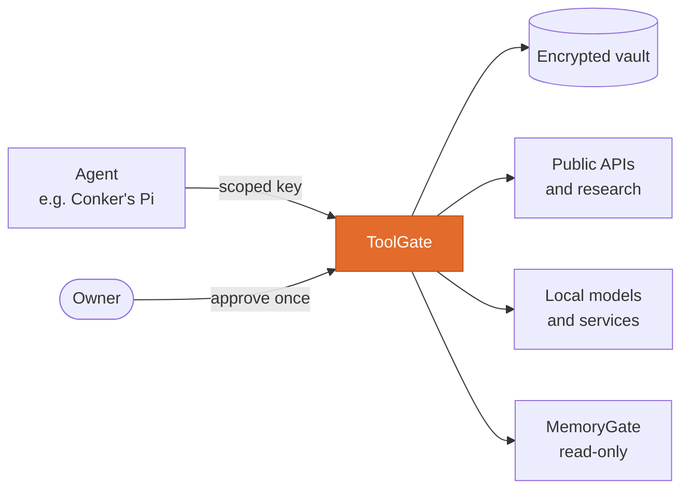

<p align="center"></p>
<h1 align="center">ToolGate</h1>
<p align="center"><b>The one door between an AI agent and the outside world.</b><br/>
Typed tools, exact single-use approvals, spending limits and a receipt for everything.</p>
<p align="center">
  <a href="https://github.com/Conker-AI/toolgate/actions/workflows/ci.yml"></a>
  
  <a href="LICENSE"></a>
  <a href="https://github.com/Conker-AI/conker"></a>
</p>

ToolGate is a self-hosted control plane for what an agent may *do*. The agent never holds provider
credentials and never runs code of its own. It calls typed capabilities with a scoped key, and
ToolGate checks policy, asks the owner when needed, runs the action, and records the outcome.

It is part of [Conker](https://github.com/Conker-AI/conker), a personal AI companion you host
yourself, and it works on its own with any agent.

## Where it fits



## What it does

| Object | What it is |
|---|---|
| **Service** | A provider identity with write-only secrets, destination policy and health. |
| **Tool** | One atomic, typed operation run by a restricted executor. Tools cannot call other tools. |
| **Automation** | A versioned, deterministic workflow of tools and bounded control blocks. |
| **Request** | Something waiting for the owner: a verification, warning, proposal or update. |

- **Approvals are exact.** An approval binds the object, version, argument digest, nonce and expiry.
  It is consumed once; a replay or changed argument fails closed.
- **Secrets stay put.** Vault values are write-only and encrypted at rest. No API returns one.
- **Money has ceilings.** Paid routes stay off until prices, limits and a job are configured.
  An interrupted call is held as `outcome_unknown`, never retried blindly.
  ([details](docs/DURABLE_EXECUTION_AND_SPENDING.md))
- **Health is real.** `/health` probes every dependency and says `degraded` when one fails.
- **No arbitrary code.** Executors are a fixed set: HTTP JSON, research search and fetch,
  MemoryGate reads and bounded model calls.


## Quick start

Requires Docker with Compose.

```bash
cp toolgate/.env.example toolgate/.env
docker network create conker_net        # once; shared with the other Conker services
cd toolgate && docker compose up -d --build
```

Open the dashboard at `http://localhost:8011`; the API is on `http://localhost:8010`. Control keys
are generated on first start and never logged. Read them once from `toolgate/.env`, then protect
that file. Back up the vault key with the data: [deployment guide](docs/deployment.md).

## Using it from an agent

```bash
toolgate tool list
toolgate tool research.search --action-id plan-42 --query "judo clubs near me"
```

The CLI needs only the Python standard library and a scoped key. An opt-in MCP bridge enforces the
same scopes and approvals. See [agent access](docs/agent-access.md).

## Security model, briefly

- Agents use rotatable execution keys with explicit scopes. Management needs a separate admin key.
- Lockdown stops agent execution, new requests and callbacks in one switch.
- Research never takes a URL from the agent. It fetches only server-issued handles, rejects private
  and metadata destinations at the socket, and marks fetched text as untrusted.
- Logs and responses carry references and redacted outcomes, never secret values.

ToolGate reduces agent and prompt-injection risk; it cannot protect a host that is already
compromised. Keep the API private. Full model: [security](docs/security.md).

## Development

```bash
pip install -r toolgate/requirements.txt pytest httpx
python -m pytest toolgate/tests --ignore=toolgate/tests/test_module_contract.py -q
python toolgate/scripts/mutation_check.py     # proves the tests catch broken behaviour
```

More, including the live boundary verifier: [testing](docs/testing.md).

```text
toolgate/api/        FastAPI owner and agent API, executors, automation runtime
toolgate/core/       SQLite control plane, policy, vault
toolgate/executors/  Research search and fetch adapters
toolgate/cli/        Standard-library agent CLI
toolgate/mcp/        Opt-in authenticated MCP bridge
dashboard/           React owner dashboard
```

## Documentation

| | |
|---|---|
| [Security model](docs/security.md) | Scopes, vault, approvals, research boundary, callbacks |
| [Automations](docs/automations.md) | Workflows, revisions, publication, nested runs |
| [Agent access](docs/agent-access.md) | CLI and MCP bridge |
| [Deployment](docs/deployment.md) | Compose, vault key, health, upgrades |
| [Durable execution and spending](docs/DURABLE_EXECUTION_AND_SPENDING.md) | Action IDs, budgets, unknown outcomes |
| [Approval integrity](docs/APPROVAL_INTEGRITY.md) | How approvals are bound and consumed |
| [Testing](docs/testing.md) | Suites, mutation check, live verifier |
| [API (OpenAPI)](docs/openapi.json) | Full route reference |

## License

[MIT](LICENSE)
